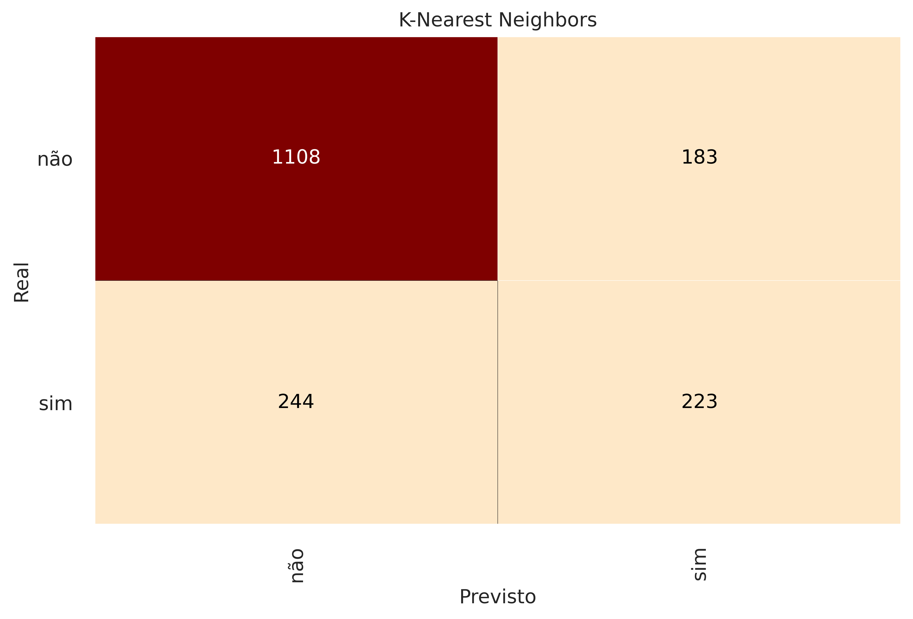
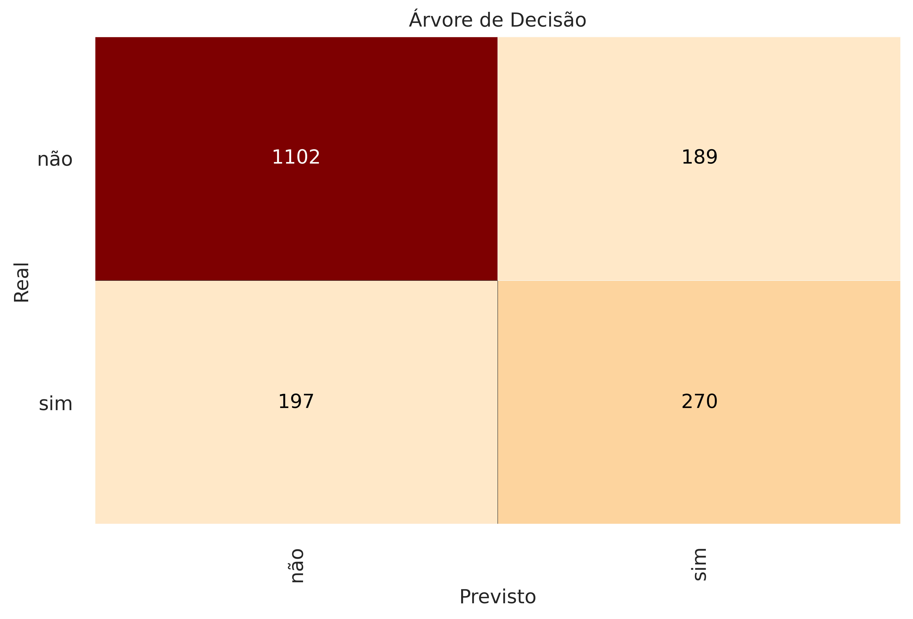
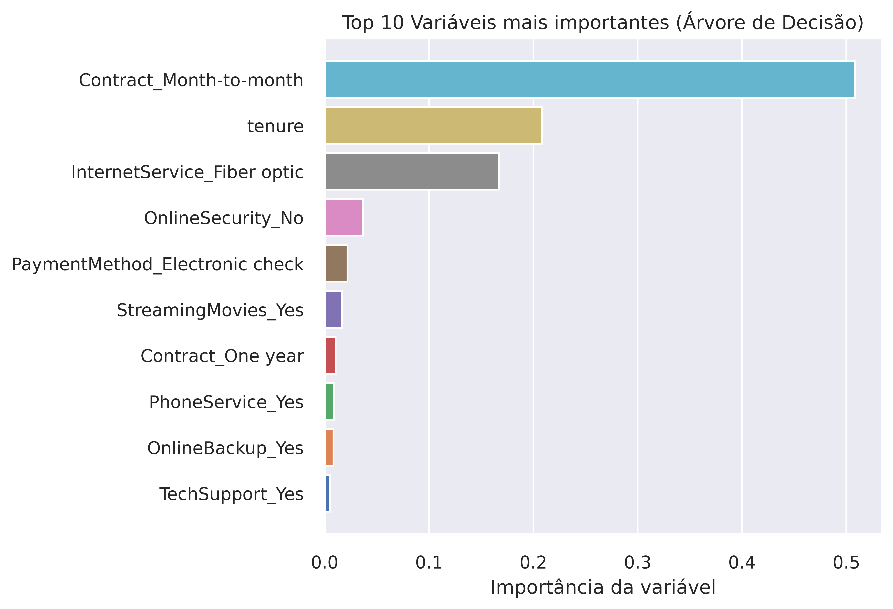
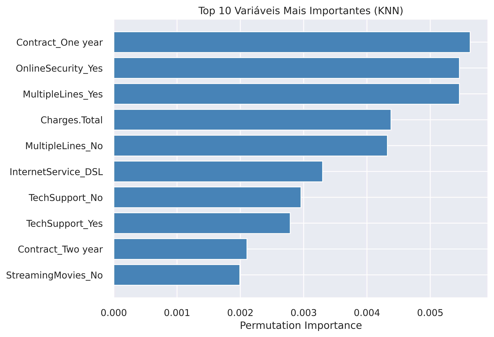
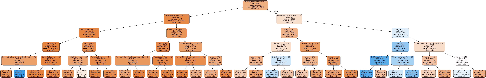

  <h1>📊 Telecom X: Previsão de Evasão de Clientes</h1>
  <h2 align="center">🎓 Projeto Desafio Parte 2 — Alura e Oracle Next Education (ONE)</h2>
  <h2 align="center">   Formação em Data Scienc</h2>
  

    <em>Análise comparativa de modelos de Machine Learning para identificar e avaliar a evasão de clientes.</em>
  

 

  
  
  
  
  
  
  

 

> **Estrutura Completa de Machine Learning: Previsão de Churn TelecomX**
Este projeto detalha o fluxo de trabalho ponta a ponta para mitigar a perda de clientes na TelecomX. O processo abrange desde a preparação inicial dos dados até a geração de inteligência estratégica para o negócio:

**Preparação de Dados:** Etapas rigorosas de pré-processamento e técnicas para solucionar o desbalanceamento das classes.

**Modelagem Preditiva:** Estudo comparativo de performance entre os modelos K-Nearest Neighbors (KNN) e Árvore de Decisão (Decision Tree).

**Análise de Performance:** Avaliação detalhada das métricas de sucesso e tradução dos resultados em insights acionáveis.

Desafio da segunda etapa do Challenge Telecom X, focada em transformar dados brutos em previsões precisas.

 

<h2>📌 O Problema de Negócio</h2>

  Estratégia de Retenção <strong>TelecomX</strong>: Inteligência Artificial contra o Churn
  Diante do desafio da alta rotatividade em sua base de usuários, a TelecomX buscou na ciência de dados uma solução para otimizar seus custos operacionais. Como a conquista de novos consumidores exige investimentos muito superiores à manutenção dos atuais, este projeto focou no desenvolvimento de modelos de <strong>Machine Learning</strong>.

  O objetivo central foi mapear padrões comportamentais e antecipar quais perfis apresentam maior risco de cancelamento. Com essas previsões em mãos, a empresa deixa de ser reativa e passa a atuar de forma estratégica, aplicando medidas de fidelização antes que o cliente decida interromper o serviço.

<h2>🛠️ Tecnologias Utilizadas</h2>

| Tecnologia | Versão | Uso no Projeto |
| :--- | :---: | :--- |
| Python | 3.10+ | Linguagem base dos scripts |
| Pandas | 2.2+ | Manipulação, limpeza e análise exploratória dos dados|
| NumPy | 2.0+ | Operações numéricas |
| Scikit-learn | 1.6+ | Modelos (KNN e Árvore de Decisão), métricas e pré-processamento |
| Matplotlib | 3.10+ | Criação de gráficos estáticos e customizados |
| Seaborn | 0.13+ | Visualização estatística de dados |
| Google Colab | — | Ambiente de desenvolvimento e execução do notebook |
| Git/GitHub | — | Controle de versão e hospedagem |

<h2>⚙️ Metodologia e Pipeline</h2>
<ol>
  <li><strong>Tratamento e Transformação:</strong> Aplicação de <code>OneHotEncoder</code> e <code>StandardScaler</code> para normalização das variáveis numéricas, garantindo menor impacto em K-Nearest Neighbors (modelo sensível à escalas).</li>
  <li><strong>Otimização (Hyperparameter Tuning):</strong> Uso do <code>GridSearchCV</code> focado na métrica <em>F1-Score</em> para encontrar os melhores hiperparâmetros e lidar com o desbalanceamento das classes.</li>
</ol>

<h2>📈 Análise e Resultados dos Modelos</h2>

  A <strong>Árvore de Decisão Otimizada</strong> apresentou um desempenho superior, alcançando um <em>Recall</em> de <strong>0.578</strong> (identificando corretamente quase 60% dos clientes prestes a cancelar) e mantendo uma Precisão na casa dos <strong>85%</strong> para a classe majoritária ("não").

<h3>Comparativo de Métricas</h3>

| Modelo | Evasão (Churn) | Precisão | Recall | F1-Score |
| :--- | :---: | :---: | :---: | :---: |
| 🌳 **Árvore de Decisão** | `sim` | 0.588 | **0.578** | **0.583** |
| 🌳 **Árvore de Decisão** | `não` | 0.848 | 0.854 | 0.851 |
| 📏 **KNN** | `sim` | 0.549 | 0.478 | 0.511 |
| 📏 **KNN** | `não` | 0.820 | 0.858 | 0.838 |

  <h3>Matrizes de Confusão</h3>
      
      

Na análise de interpretabilidade das variáveis mais importantes (<em>Feature Importance</em>), os modelos apresentaram estratégias diferentes de decisão:

<ul>
  <li>🌳 <strong>Árvore de Decisão:</strong> Focou esmagadoramente em três fatores principais (Contrato Mensal, Tempo de Permanência e Internet Fibra Ótica), criando regras rígidas de corte.</li>

  <li>📏 <strong>KNN:</strong> Apresentou uma distribuição mais equilibrada, considerando o pacote de serviços como um todo (Segurança Online, Múltiplas Linhas) e as Cobranças Totais para encontrar perfis similares.</li>
</ul>

  <h3>Visualização das Importâncias (Feature Importance)</h3>
  
<i>Comparativo: Árvore de Decisão x KNN</i>

  
  
  

  <h3>Estrutura da Árvore de Decisão Gerada</h3>
  
  

  

<h2>🚀 Como Executar</h2>

Siga os passos abaixo para testar os modelos localmente na sua máquina:

1. Clone este repositório
 
2. Instale as dependências: <code>pip install -r requirements.txt</code>
 
3. Execute o arquivo <code>'telecom_x2.ipynb'</code>
 

Após a instalação, basta abrir o arquivo <code>.ipynb</code> no Jupyter Notebook ou VS Code e executar as células sequencialmente.

Desenvolvido por:

<a href="https://github.com/FlavioHN">
        <b>Flávio Lima</b>
